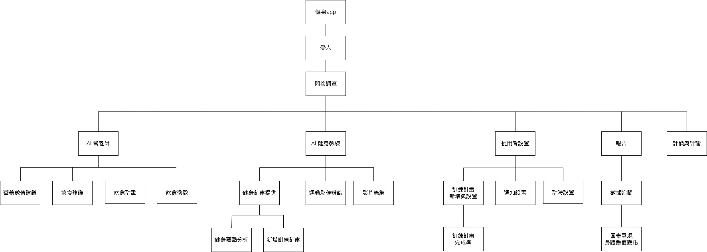
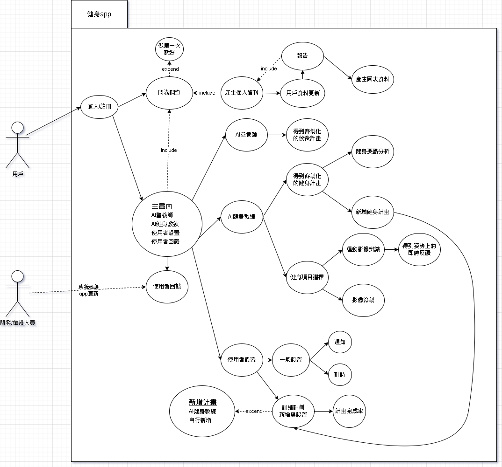
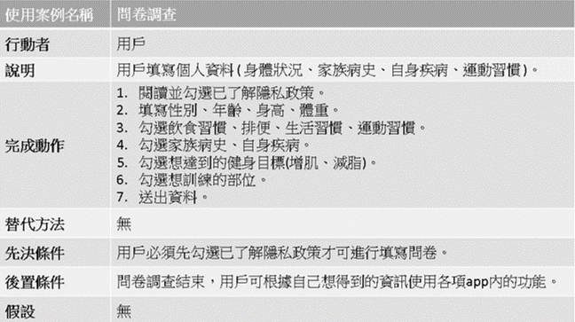
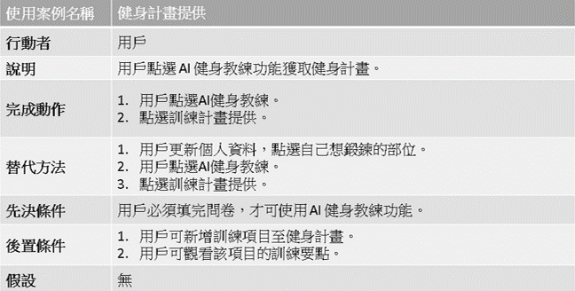
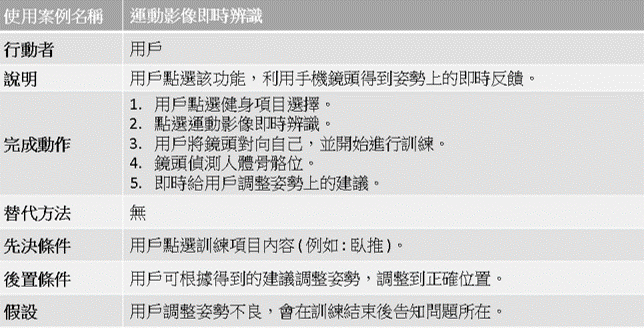

## **功能性需求**

1.問卷調查 : 開始使用APP前會先調查一些病例、以及自身身體狀況

2.AI 營養師 : 

    I.      飲食建議提供(給出建議以及不建議飲食)
    II.	建議的營養素數值(約提列七項)提供(例如 : 需要10克蛋白質)
    III.	飲食教育(根據使用者身體狀況，有無生病，去告訴使用者要注意的地方，而不是單單提供計畫。)
    IV.	飲食計畫提供(若有需求，可根據使用者喜好以及上述的飲食建議，規劃出一周的飲食計畫，以表格的方式呈現)
    
3.AI 健身教練 :

    I.	健身計畫提供(根據自己的喜好，可以隨時更改自己想要鍛鍊的部位，或者主要需求，再將項目新增至訓練計畫)
    II.	健身要點分析(會給一些圖片或影片告知使用者，做動作時所需注意的重點)
    III.	運動影像辨識(利用手機鏡頭，偵測骨骼位置是否正確，並及時提供反饋)
    IV.	影片錄製(可將運動時的畫面錄製下來以便使用者日後進行矯正)
    
4.使用者設置 : 

    I.	訓練設置(計時功能)
    II.	通知設置(提醒健身)
    III.	訓練計畫設置(可自定義健身計畫，或者從AI健身教練所提供的訓練計劃直接新增健身計畫)
5.報告 : 

    I.     數據追蹤(將日後身體狀況數值記錄下來，並且以圖表呈現給使用者，若使用者有更新，則相對的飲食計畫及運動計畫也會隨之更動)
    
6.使用者回饋 : 可根據用戶的評論來進行APP的更新、維護。
    

## **非功能性需求**

1.	反應時間(response time) ：對AI做的提問可約莫在5~10秒給出答案，20秒內給出健身計劃以及圖表等等。 
2.	使用性(usability)：我們希望可以將使用者介面做的簡單明瞭，讓使用者可在使用次數2~3次就了解APP的完整功能。 
3.	可靠度(reliability)：由於沒有相對專業的團隊以及足夠的時間可以給出大量的資料，因此初期可能會給出不符合使用者能力上的建議。 
4.	維護性(maintainability)：透過快捷法的方式先做出雛形然後再透過使用者回饋來進行APP的更新以及維護。
5.	兼容性(compatibility)： 可運行在任何 Android系統的設備上 。

## **功能分解圖**

## **需求分析的文字描述**

(1) 使用者先透過註冊/登入進入app。

(2) 使用者填寫一些身體狀況、運動習慣、病例等個人資料。

(3) 用戶可選擇營養師功能得到飲食建議、計畫、以及身體狀況的資料。

(4) 用戶可選擇 AI 健身教練的功能得到健身計畫、要點分析。

(5) 用戶選擇好訓練項目後可開啟運動影像辨識，得到即時反饋。

(6) 用戶可選擇錄製影片，在日後進行動作矯正。

(7) 用戶可自訂健身計畫，加上通知功能，使其在健身路上不迷路。

(8) 用戶透過更新身體狀況，得到自己在體態變化的簡易圖表。

(9) 營養師、健身教練透過圖表，彈性調整提供的飲食以及健身計畫。

(10) 使用者可透過回饋，告知開發/維護人員須要改進或維修的地方。

## **使用案例圖**

## **使用案例說明**

