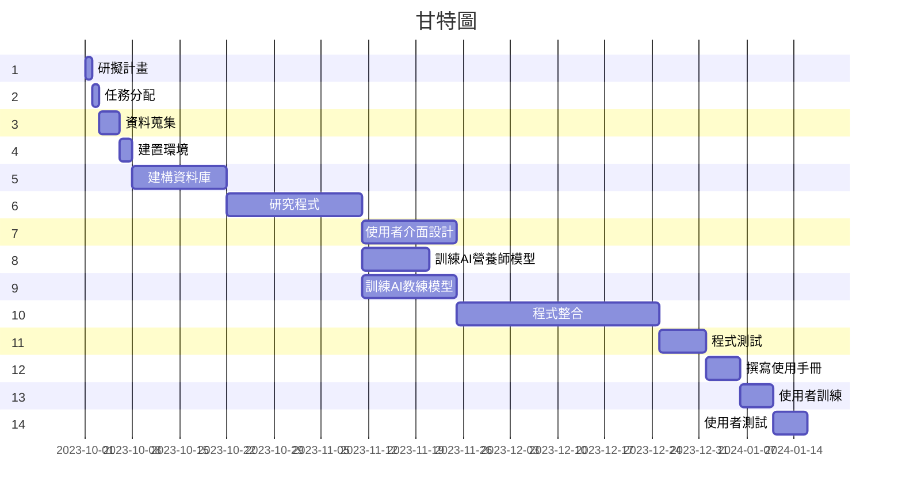

# 甘特圖

```mermaid
gantt
    title 甘特圖

    section 1
    研擬計畫           :a1, 2023-10-01, 1d
    section 2
    任務分配      :a2, after a1  , 1d
    section 3
    資料蒐集      :a3, after a2  , 3d
    section 4
    建置環境      :a4, after a3  , 2d
    section 5
    建構資料庫      :a5, after a4  , 14d
    section 6
    研究程式      :a6, after a5  , 20d
    section 7
    使用者介面設計      :a7, after a6  , 14d
    section 8
    訓練AI營養師模型      :a8, after a5 and a6  , 10d
    section 9
    訓練AI教練模型      :a9, after a5 and a6  , 14d
    section 10
    程式整合      :a10, after a7 and a8 and a9  , 30d
    section 11
    程式測試      :a11, after a10  , 7d
    section 12
    撰寫使用手冊      :a12, after a11  , 5d
    section 13
    使用者訓練      : a13 ,after a12 ,5d
    section 14
    使用者測試      : a14 ,after a13 ,5d

```
